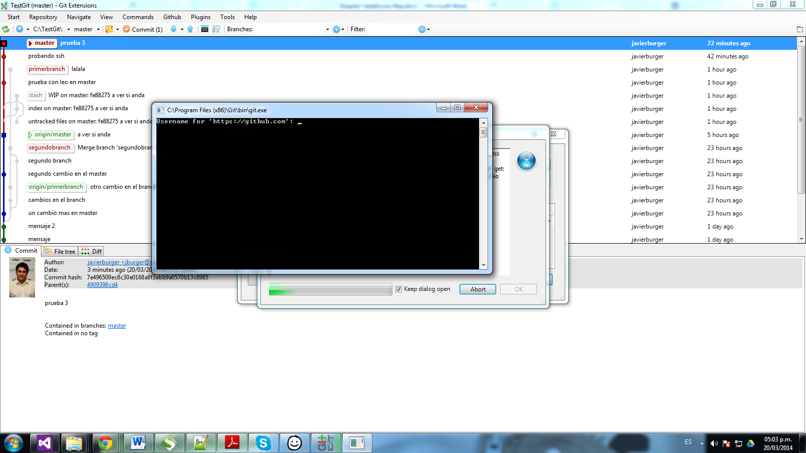

### Issue when is performed a push to a remote repo

Git Extensions has an issue when you want to do the Push to a remote repo where is requested on each "push" your username and password and it could be very tedious for developers enter them in each action.

To solve this, should be modified the `.gitconfig` file located in "C:\Users\[USERNAME]\.gitconfig". This file contains this structure:

[merge]
	tool = kdiff3
[mergetool "kdiff3"]
	path = C:/Program Files (x86)/KDiff3/kdiff3.exe
[diff]
	guitool = kdiff3
[difftool "kdiff3"]
	path = C:/Program Files (x86)/KDiff3/kdiff3.exe
[core]
	editor = \"C:/Program Files (x86)/GitExtensions/GitExtensions.exe\" fileeditor
	autocrlf = true
[credential]
	 helper = !\\\"C:/Program Files/GitExtensions/GitCredentialWinStore/git-credential-winstore.exe\\\"
[user]
	name = [your username]
	email = [your email]
	
* The `[credential]` tag should be modified by: 
[credential]
 helper = !\"C:/Program Files/GitExtensions/GitCredentialWinStore/git-credential-winstore.exe\"
	
	
