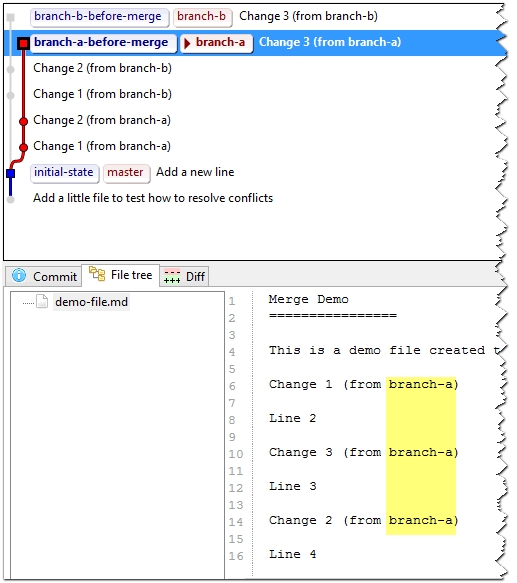

### Solve merge and rebase conflicts

Imagine that there are two branches and you want to merge them, there are two main ways to do it:

* Merge: It creates a new commit with two parents, the last commit of each branch. All conflicts between the branches are resolved in that commit (See more information in [git-merge Manual Page](http://git-scm.com/docs/git-merge)).
* Rebase: It re-apply all the commits of one of the branches next to the last commit from the other (See more information in [git-rebase Manual Page](http://git-scm.com/docs/git-rebase)).

#### Initial state

Suppose that we have a repository with only one file with the follow content:

    Merge Demo
    ================
    
    This is a demo file created to demonstrate how to resolve conflicts with git.
    
    Line 2
    
    Line 3
    
    Line 4

#### Branch A state before merge

We have a `branch-a` with 3 commits, one for each change, the content of last version of the file before merge in this branch is:

    Merge Demo
    ================
    
    This is a demo file created to demonstrate how to resolve conflicts with git.
    
    Change 1 (from branch-a)
    
    Line 2
    
    Change 3 (from branch-a)
    
    Line 3
    
    Change 2 (from branch-a)
    
    Line 4

#### Branch B state before merge

We have a `branch-b` with 3 commits, one for each change, the content of last version of the file before merge in this branch is:

    Merge Demo
    ================
    
    This is a demo file created to demonstrate how to resolve conflicts with git.
    
    Change 2 (from branch-b)
    
    Line 2
    
    Change 3 (from branch-b)
    
    Line 3
    
    Change 1 (from branch-b)
    
    Line 4

#### Desired state

Suppose that we expect the follow content after the merge:

    Merge Demo
    ================
    
    This is a demo file created to demonstrate how to resolve conflicts with git.
    
    Change 2
    
    Line 2
    
    Change 3
    
    Line 3
    
    Change 2
    
    Line 4

#### Merge process

TODO

#### Rebase process
