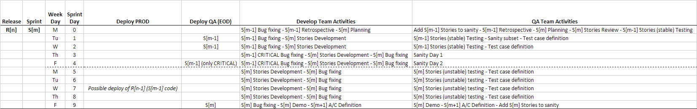

### DCA Flow

<!-- I am not sure to include the complete Project and Client name here -->

**_based on [git-flow]_**

In this project we have time boxed sprints and previously defined release dates. 
Also, QA team is not so integrated in development process, there is not a large 
unit test coverage and neither a large automated test coverage yet. So, right 
now, in order to ensure quality we need a relatively large time of manual test 
over a stable environment. 

This is basically our workflow:

1. In a sprint, DEV team develop a set of features or stories. 
2. Before integrate each feature, DEV team made a quick pair code review.
3. During the sprint DEV team deploy regularly to INT environment to allow QA 
   team to test there in an relatively unstable environment.
4. At the end of the sprint, DEV team deploy to QA environment where a demo is 
   presented and the client suggest some minor changes or fixes. QA team will 
   work on QA branch testing the sprint output in a stable environment and doing 
   a sanity or regression test.
5. DEV Team apply client suggestions and fix the bugs detected by QA team in the 
   next sprint, at the same time that they work on next sprint features but 
   without mixing the code. 
6. QA environment fixes are deployed regularly. And after some stabilization, 
   it is ready to go to Production, we do not deploy to production in all sprints.
7. In specific dates, we deploy to production all stable code.

#### Origin repository

Our "central" repository path is https://github.com/MakingSense/dca (it does not 
exist yet), we will call it **origin** (and suggest to call it origin in your 
local clones).

In the origin repository we maintain: _develop_ branch, _stabilization_ branch, 
_releases_ branches, _hotfixes_ branches, _releases_ tags and optionally 
_features_ branches.

#### Personal forks

We animate the team to have personal forks of origin repository in order to work
freely (we suggest to call it with your username in your local clones).

In a personal fork are maintained _features_ branches and whatever the 
contributor wants.

**Note:** It is allowed to _rewrite the history_ in personal branches, but try 
to not do it on branches with _pull request_ associated or shared with other 
users.

#### Our git flow

**Initial configuration:** 

team members have cloned origin repository in their 
local environments (see [clone a remote repo]). Also, they have created 
personal forks (see [fork a remote repo]) and they have configured their local 
"remotes" repositories (see [configure remotes]). 

Sprint `N` starts. In the planning we choose a lot features to implement!

**Steps:**

1. A developer chooses a task or feature to implement from sprint board.

    * If the task is enough large, he can create a sub-task and put it in "in 
      progress" state. 
    * He updates his local clone with the latest changes (see [fetch remotes]).
    * Based on _develop_ branch, he creates a local branch for the feature (with 
      a representative name) (see [create a new branch]).
	  
2. Our developer works in the task

    * He tries to commit atomic and meaning changes (see [commit changes]).
    * He tries to keep his changes pushed to a remote repository, it could be 
      _origin_ or his _personal fork_ (see [push to a remote repo]).
	  
3. Task is done

    * Our developer commits and push all his changes to the remote and creates 
      a _pull request_ to _develop_(see [creating a pull request]).
    * Some other developers in the team do a quick code review.
    * After someone else has reviewed and signed off on the feature it could be 
      merged to _develop_. If something is wrong, discussion can continue in the 
      _pull request_ and fixes can be pull to the _feature_ branch (see 
 	  [working with pull requests]).

4. Sprint finishes

    * Someone merge _develop_ branch to _stabilization_ branch (see 
      [merge remote branches]). It is a modification over [git-flow].
    * Sprint `N+1` starts with a planning.

5. Issues in _stabilization_ branch

    * The client and QA team detect issues in _stabilization_ branch, they are 
      prioritized and some of them cold be included in current sprint `N+1`
    * In order to fix them, our developer creates a new branch, the steps are 
      like in points `1`, `2` and `3` but based on _stabilization_ branch in 
	  place of _develop_.
    * _stabilization_ branch is fairly often merged to _develop_.

6. Release is closer

    * Someone creates a new branch based on _stabilization_ to prepare production 
      release, do minor bug fixes and preparing meta-data like version number, 
	  build dates, etc.
    * When it is done, is merged to _master_ branch, tagged with the version 
      number and deployed to production immediately.
    * Of course, the changes and fixes are fairly often merged to _develop_ and 
      _stabilization_ branches.

7. Hurry! A critical issue in Production!

    * If something goes wrong in production, the process to fix it is similar to 
      steps `1`, `2` and `3` but based on a new _hotfix_ branch based on _master_ 
	  branch.

	  

[git-flow]: http://nvie.com/posts/a-successful-git-branching-model/
[clone a remote repo]: /migration-to-git/3-working-with-git/clone-remote-repo.html
[fork a remote repo]: /migration-to-git/3-working-with-git/fork-a-repo.html
[configure remotes]: /migration-to-git/3-working-with-git/configure-remotes.html
[fetch remotes]: /migration-to-git/3-working-with-git/fetch-remotes.html
[create a new branch]: /migration-to-git/3-working-with-git/create-a-new-branch.html
[commit changes]: /migration-to-git/3-working-with-git/commit-changes.html
[push to a remote repo]: /migration-to-git/3-working-with-git/push-to-a-remote-repo.html
[creating a pull request]: /migration-to-git/3-working-with-git/creating-a-pull-request.html
[working with pull requests]: /migration-to-git/3-working-with-git/working-with-pull-requests.html
[merge remote branches]: /migration-to-git/3-working-with-git/merge-remote-branches.html