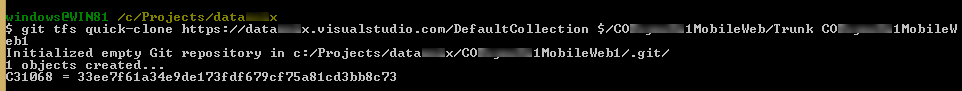

### 1. Clone TFS to a local git repository

The command [clone](https://github.com/git-tfs/git-tfs/blob/master/doc/commands/clone.md) allows to clone a branch with all _changesets_. 

The same command allows to [clone all the branches](https://github.com/git-tfs/git-tfs/blob/master/doc/commands/clone.md#clone-all-the-branches-and-merge-changesets)) (but I didn't test it).

But it used to fail:

If you don't need the complete history, it is possible to get only the last _changeset_ with the command [quick-clone](https://github.com/git-tfs/git-tfs/blob/master/doc/commands/quick-clone.md).

### 2. Prepare repository for Git

<!-- TODO (git configuration files, delete files, etc) -->

### 3. Create a new GitHub repository

<!-- TODO -->

### 4. Push local cloned commits to GitHub repository

<!-- TODO -->

