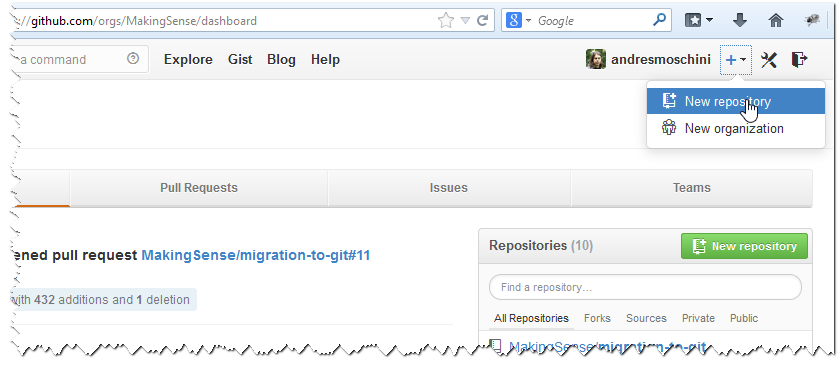
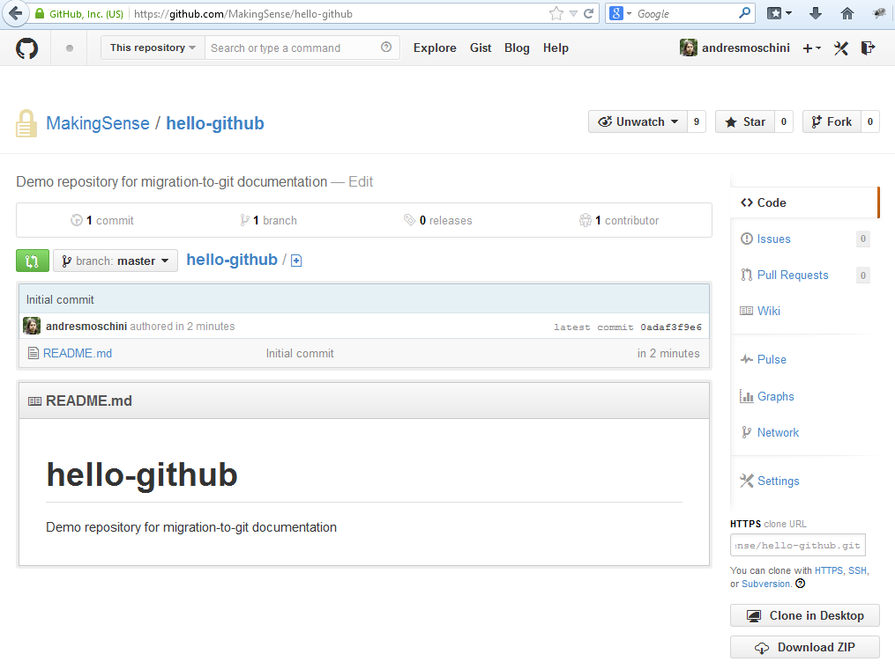
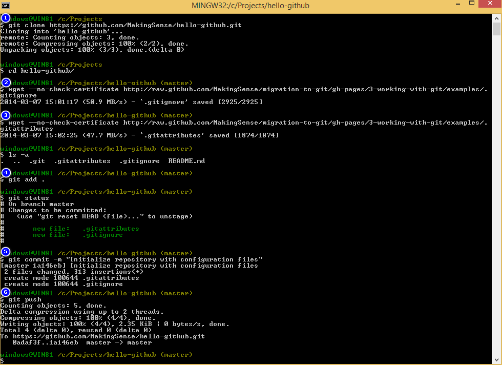

This is an example about how to prepare a repository with our default configuration.

Please, look it as a simple guide and not as a required step by step, you can adapt it to your needs.

GitHub allows you to create repositories easily. Our Making Sense official repositories will be created inside Making Sense organization, you can choose the repository name, enter an optional description, select the related team, make it public or private, and add some default files like a readme.

We did not choose to add `.gitignore` because we will download [our default gitignore] and also [our default gitattributes].

The repository is created at GitHub.

We will clone it locally `(1)` in order to our files (see [clone a remote repo]).

We download [our default gitignore] `(2)` by the raw file GitHub URL: <https://raw.githubusercontent.com/{{ site.github.repository_nwo }}/master/migration-to-git/3-working-with-git/examples/.gitignore> (In the screenshot we are using `wget` command which is not included on Windows by default).

And also [our default gitattributes] `(3)`. The raw file GitHub URL is: <https://raw.githubusercontent.com/{{ site.github.repository_nwo }}/master/migration-to-git/3-working-with-git/examples/.gitattributes>

It is ready to commit (see [commit changes]), so we add all files to the index `(4)` and `(5)` commit them.

And push it to our GitHub repository `(6)` (see [push to a remote repo]).

Congrats! Your repo is done to add your project files.

It is not related to repository preparation, but at this point it could also be useful to take a look at our recommendations on [.gitconfig-file].

[clone a remote repo]: {{ site.github.url }}/migration-to-git/3-working-with-git/clone-remote-repo.html
[our default gitignore]: {{ site.github.repository_url }}/blob/master/migration-to-git/3-working-with-git/examples/.gitignore
[our default gitattributes]: {{ site.github.repository_url }}/blob/master/migration-to-git/3-working-with-git/examples/.gitattributes
[commit changes]: {{ site.github.url }}/migration-to-git/3-working-with-git/commit-changes.html
[push to a remote repo]: {{ site.github.url }}/migration-to-git/3-working-with-git/push-to-a-remote-repo.html
[.gitconfig-file]: {{ site.github.url }}/migration-to-git/3-working-with-git/gitconfig-file.html