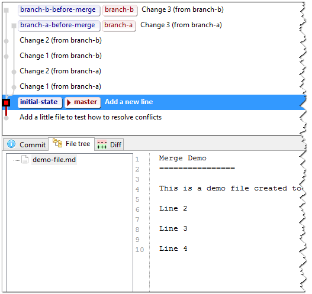
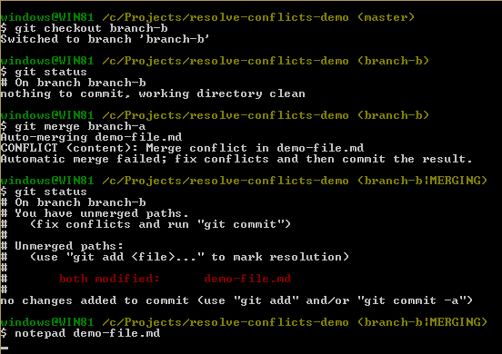
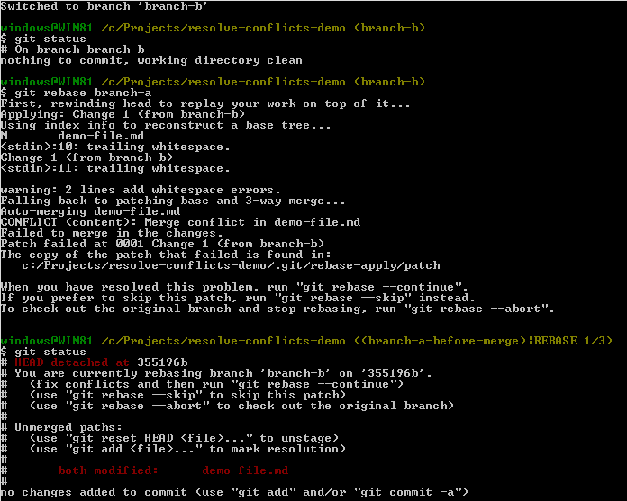
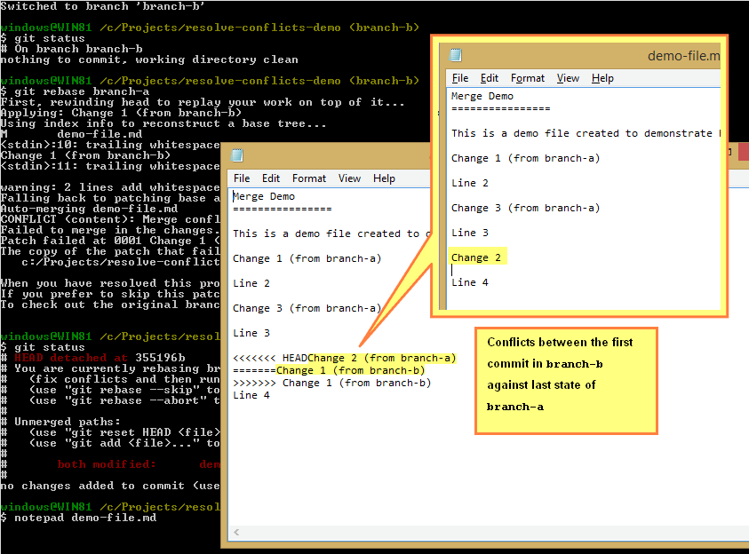
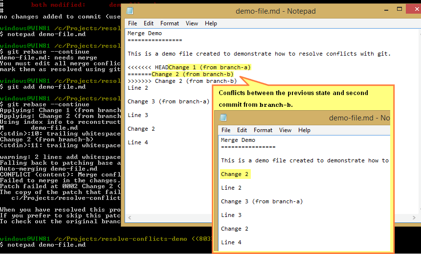
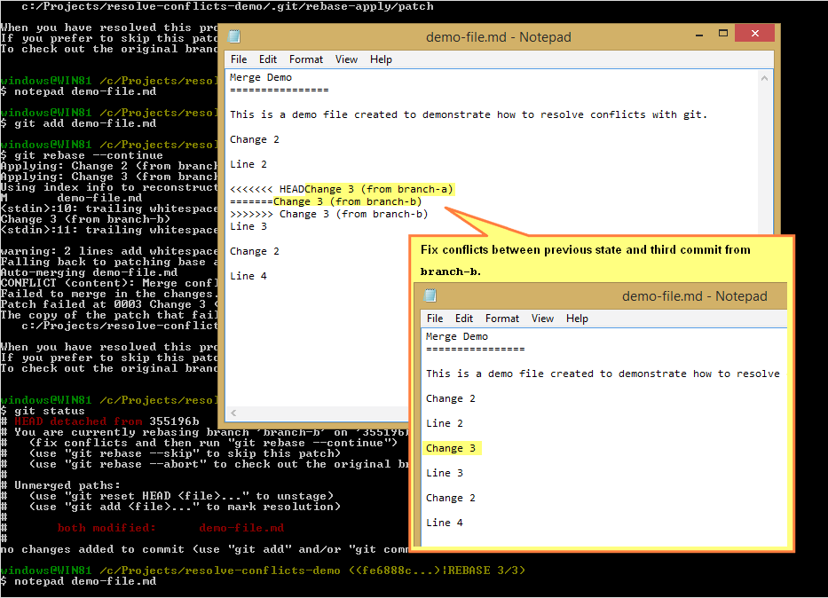

### Solve merge and rebase conflicts

Imagine that there are two branches and you want to merge them, there are two main ways to do it:

* Merge: It creates a new commit with two parents, the last commit of each branch. All conflicts between the branches are resolved in that commit (See more information in [git-merge Manual Page](http://git-scm.com/docs/git-merge)).
* Rebase: It re-apply all the commits of one of the branches next to the last commit from the other (See more information in [git-rebase Manual Page](http://git-scm.com/docs/git-rebase)).

The idea of this document is to illustrate both process from the beginning to the end.

#### Scenario

##### Initial state



Suppose that we have a repository with only one file with the follow content:

```
    Merge Demo
    ================

    This is a demo file created to demonstrate how to resolve conflicts with git.

    Line 2

    Line 3

    Line 4
```

##### Branch A state before merge


We have a `branch-a` with 3 commits, one for each change, the content of last version of the file before merge in this branch is:

```
    Merge Demo
    ================
    
    This is a demo file created to demonstrate how to resolve conflicts with git.
    
    Change 1 (from branch-a)
    
    Line 2
    
    Change 3 (from branch-a)
    
    Line 3
    
    Change 2 (from branch-a)
    
    Line 4
```


##### Branch B state before merge


We have a `branch-b` with 3 commits, one for each change, the content of last version of the file before merge in this branch is:

```
    Merge Demo
    ================
    
    This is a demo file created to demonstrate how to resolve conflicts with git.
    
    Change 2 (from branch-b)
    
    Line 2
    
    Change 3 (from branch-b)
    
    Line 3
    
    Change 1 (from branch-b)
    
    Line 4
```

##### Desired state

Suppose that we expect the follow content after the merge:

```
    Merge Demo
    ================
    
    This is a demo file created to demonstrate how to resolve conflicts with git.
    
    Change 2
    
    Line 2
    
    Change 3
    
    Line 3
    
    Change 2
    
    Line 4
```

#### Merge process

We want to merge `branch-a` into `branch-b`.

```
$ git checkout branch-b
$ git merge branch-a
```



But there are conflicts. So we will edit it with notepad (you can also use your favorite merge tool, I like [p4merge](http://danlimerick.wordpress.com/2011/06/19/git-for-window-tip-use-p4merge-as-mergetool/))


Notice that the conflicts are all together, and are fixed in only one step.

When the result file is done, we commit the modified file, creating a merge commit with two parents.

```
$ git add demo-file.md
$ git commit -m 'Merge branch-a'
```


#### Rebase process

To demonstrate Rebase, I will reset the state as before to merge. And then start to rebase `branch-b` on `branch-a`.

```
$ git checkout branch-b
$ git rebase branch-a
```



It shows a conflict between `branch-a` and the first commit of `branch-b`



When it is fixed (with notepad in this case), we apply the changes and continue with rebase process.

```
$ git notepad demo-file.md
$ git add demo-file.md
$ git rebase --continue
```




In this case there are conflicts between the result of previous state and the second commit of `branch-b`.



And conflicts with the third commit. When all `branch-b` commits are applied on top of `branch-a`, the rebase finish.


You can download this repository with all the commits, branches and tags from <https://github.com/MakingSense/resolve-conflicts-demo.git>
