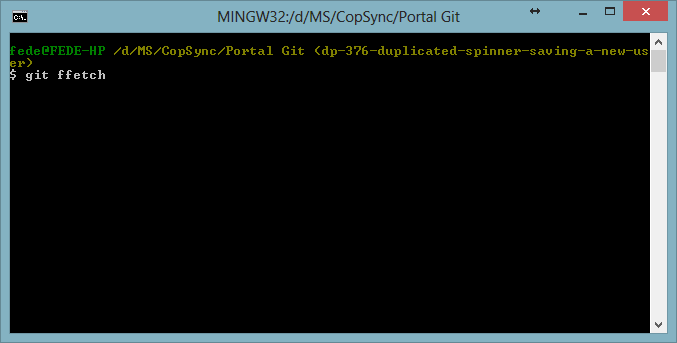
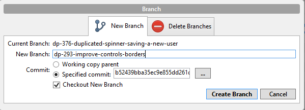
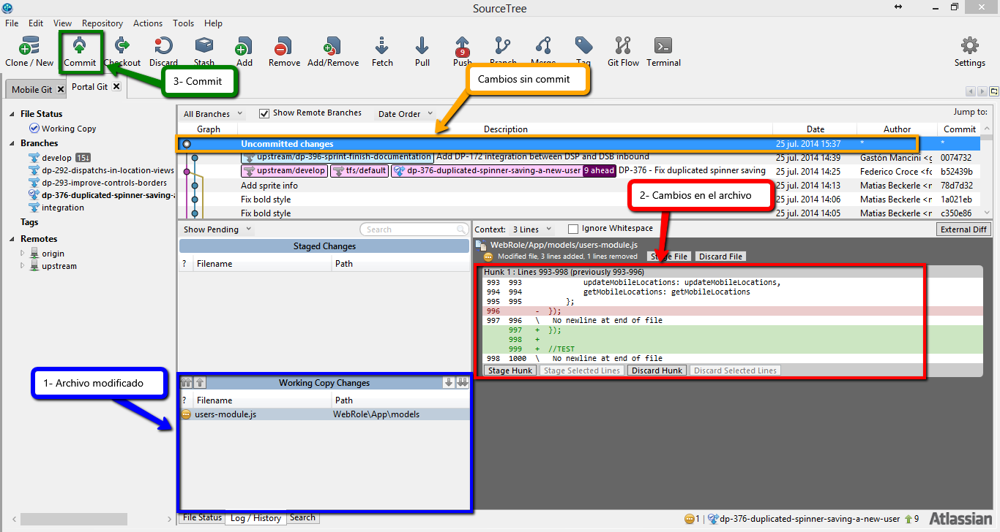
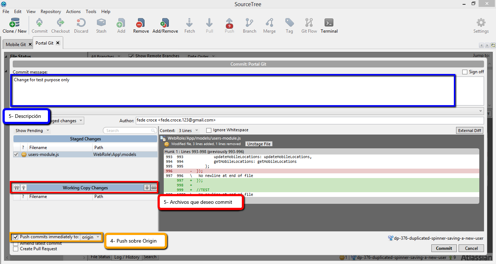
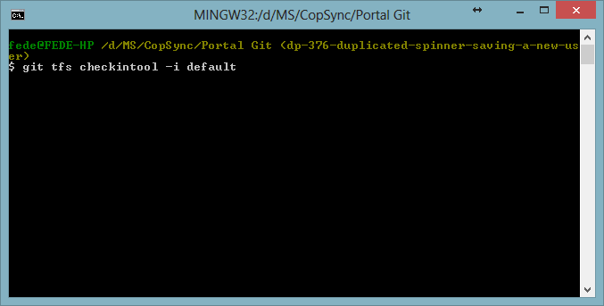
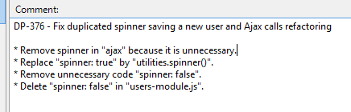

### Creación de rama (Branch): 

**Se debe crear una rama por cada tarea.**

1.	Obtengo las actualizaciones del proyecto:*  Realizo un ffetch desde el terminal de SourceTree con el siguiente código (Se puede realizar posicionado en cualquier rama).

    ```console
    $ git ffetch
    ```

    

2.	Me posiciono sobre **upstream/develop:*** realizo un “checkout” desde el terminal de SourceTree con el siguiente código 

	```console
	$ git checkout -B develop upstream/develop.
	```
	  
	


3.	Creo la rama: Botón derecho sobre **upstream/develop** y luego selecciono Branch. Le asigno un nombre a dicha rama y presiono “Create Branch”. Los nombres de la rama deben cumplir los siguientes requisitos:

	* Debe estar escrita toda en minúscula.
	* Debe contener el ID de la tarea a la cual hace referencia. ej: dp-239
	* Las palabras deben ir separadas por – (guion medio).
	* El nombre de la rama deber estar relacionado con los cambios que se generar en dicha rama.


	

### Commit: 

**Verificar estar posicionado en la rama deseada**

1.	Debemos verificar si los archivos son los que hemos modificado y seleccionar el primero si poseemos más de uno.

2.	Corroborar que los cambios realizados sean correctos.

3.	Presionar “Commit”.

	

4.	*(opcional)* Seleccionar el checkbox de **Push** para realizarlo en **Origin**. (Lo recomendable es hacer el **Push** al finalizar la tarea. Otra metodología seria hacerlo con cada commit realizado).

5.	Se deben seleccionar solo los archivos que deseamos commit y que estén relacionados explícitamente con la tarea.

6.	Se debe hacer una descripción de los cambios realizados. No es necesario colocar el ID de la tarea ya que lo contiene la rama.

	

### Merge: 

1.	Obtengo las actualizaciones del proyecto:*  Realizo un ffetch desde el terminal de SourceTree con el siguiente código (Se puede realizar posicionado en cualquier rama).

	```console
	$ git ffetch
	```
	
	


2.	Me posiciono sobre la rama que deseo realizar el merge (Checkout sobre la rama).

3.	Realizo un **checkintool** sobre la rama **default** desde el terminal de SourceTree con el siguiente código 

	```console
	$ git tfs checkintool -i default
	```
	
	

4.	Se abrirá una nueva ventana de tfs en la cual debemos comentar los cambios realizados. Los comentarios de los merge deben cumplir los siguientes requisitos:

	* El ID de la tarea debe estar escrito en mayúscula y separado por – (guion medio) las letras de los números, luego un espacio y otro – (guion medio).  ej: DP-376 -

	* El título debe contener el ID de la tarea a la cual hace referencia. ej: dp-239. Este debe hacer referencia al título de dicha tarea. Luego realizar dos interlineados.

	* Se deben comentar los commit más significativos, sin interlineado, comenzando con un * (asterisco) y seguido de un espacio, letra capital y finalizarlo con un . (punto)

	
	
	

5.	Realizo un push de upstream sobre la rama develop desde el terminal de SourceTree con el siguiente código git push upstream HEAD:develop

	```console
	$ git push upstream HEAD:develop
	```
