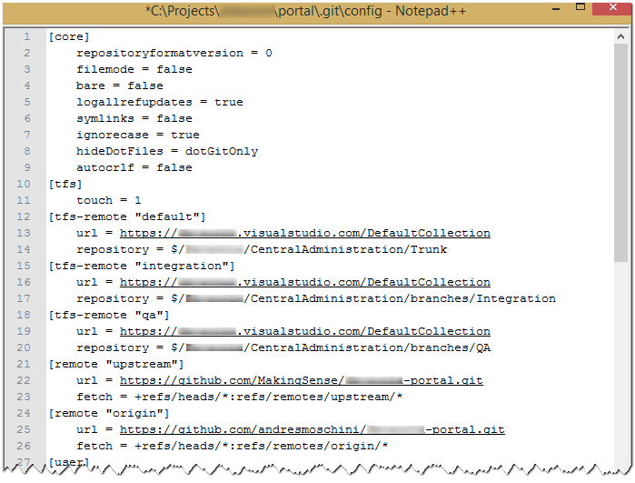
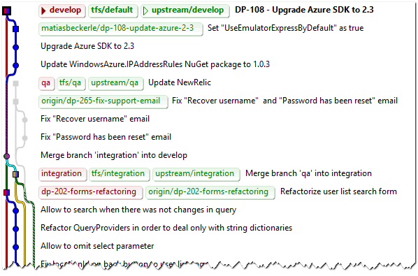
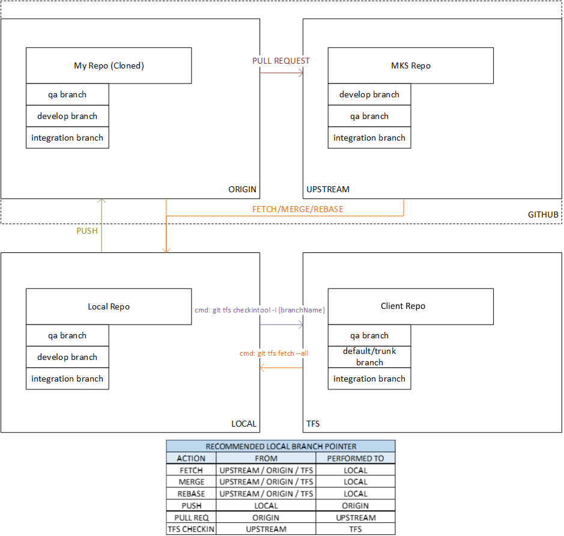

### DP Flow

**_based on [DCA flow]_**

Our DCA project has been merged with some other projects of the same client, you can find more information about the context and the desired work-flow in [DCA flow] page. The idea is basically the same, but sadly, the client requires TFS, so, we could use Git and GitHub, but each _feature branch_ should be also merged to TFS. It give us a little overhead, but is still better than pure TFS. 

#### Local environment configuration

To support this work-flow you have to download and add to your `path` [git-tfs](http://git-tfs.com/) (at the moment of writing this article, we are using the git-tfs v0.20.0) and [git-helpers](https://github.com/MakingSense/git-helpers#git-helpers).

#### Remote repositories

We have a common `upstream` repository for all the team, `upstream` branches are:

* `develop` associated to `tfs/default` (Trunk)
* `integration` branch associated to `tfs/Integration`
* `qa` branch associated to `tfs/QA`

After a clone of `upstream` you can configure TFS remotes using [bootstrap command](https://github.com/git-tfs/git-tfs/blob/master/doc/commands/bootstrap.md):

```
$ git tfs bootstrap
```

If it doesn't work (it is possible because git-tfs isn't so predictable) you can edit `.git/config`file, it is also useful if the tfs remotes names are not matching desired ones:



Each developer has a fork of `upstream`, and it is refereed in his own local clone as `origin`. If he wants, he could add references to other developers forks in order to be updated about their work or cherry pick some commits.

In developer's forks, there will be stored the _feature branches_.

The result should be something similar to this:



#### Work flow

Sprint `N` starts. In the planning we choose a lot of nice features to implement!

**Steps:**

1. A developer chooses a task or feature to implement from sprint board.

    * If the task is enough large, he can create a sub-task.
    * The task is moved to "in progress" state. 
    * Developer fetches remote Git and TFS repositories.
    ```
    # Using git-tfs and git directly
    $ git fetch upstream
    $ git checkout -B develop 
    $ git reset --hard upstream/develop
    $ git tfs fetch -i default
    ```
    ```
    # Or using our self utility function ffetch
    $ git ffetch
    ```
    * Creates a new local branch for the feature based on `upstream/develop` or `tfs/default` (see [create a new branch]). Our convention is:
        * Lowercase
        * No spaces
        * No slashes (`/` nor `\`)
        * Starts with task id
        * Example `dp-260-common-functions-to-utilities`
        ```
        $ git checkout -b dp-260-common-functions-to-utilities tfs/default
        ```
        
2. Our developer works in the task

    * He tries to commit atomic and meaning changes (see [commit changes]).
    * He tries to keep his changes pushed to his `origin` repository _feature branch_ (see [push to a remote repo]).
    * Regularly, he could fetch remotes and merge or rebase his branch on `upstream/develop` in order to keep his work updated.
	  
3. Task is done

    * In general, it is a good idea to fetch remote Git and TFS repositories and update _feature branch_ merging or rebasing.
    * Our developer push all his changes to `origin` and creates a _pull request_ to `upstream/develop` (see [creating a pull request]).
    * Some other developers in the team do a quick code review and comment in GitHub.
    * If something is wrong, discussion can continue in the _pull request_ and fixes can be push to the `origin` _feature branch_.
    * When the code has been reviewed, and eventually fixed, it could be merge into `tfs/default` using git-tfs and pushed to upstream
    ```
    $ git tfs checkintool -i default
    $ git push upstream HEAD:develop
    ```
    * The _pull request_ should be automatically closed when GitHub detects the merge.

4. Sprint finishes

    * `tfs/default` branch is merged to `tfs/integration` (and sometimes `tfs/qa`), without forgot to keep updated `upstream` branches.
    ```
    $ git ffetch
    $ git checkout integration
    $ git merge --no-ff develop
    $ git tfs rcheckin -i integration
    $ git push upstream integration:integration
    ```
    * Preparation to production is done in the new branch: updating meta-data like version number, build dates, etc.
    * Sprint `N+1` planning starts.

5. QA in `integration` and `qa` branches

    * When the client and QA team detect issues from past sprint (`N`) code, they are prioritized and some of them cold be included in current sprint (`N+1`)
    * In order to fix each of them, our developer creates a new branch, the steps are like in points `1`, `2` and `3` but based on `tfs/integration` or `tfs/qa` branches in place of `develop`.
    * Changes on `integration` and `qa` are fairly often merged to `develop`.

6. The release!

    * The release date day has arrived, `tfs/qa` is merged to a _"tag"_ version branch in TFS.
    ```
    $ git ffetch
    $ git checkout qa
    $ git tfs branch $/CompanyName/CentralAdministration/tags/v1.30.0 tag-v1.30.1
    ```
    * And all QA and Intergration changes should be backward merged to Develop
    ```
    $ git ffetch
    $ git checkout integration
    $ git merge --no-ff qa
    $ git tfs rcheckin -i integration
    $ git push upstream integration:integration
    $ git checkout develop
    $ git merge --no-ff integration
    $ git tfs rcheckin -i develop
    $ git push upstream develop:develop
    ```

7. Hurry! A critical issue in Production!

    * If something goes wrong in production, the process to fix it is similar to steps `5` but in place of using `integration` or `qa` branches, it is done in a new _hotfix branch_ based on _"tag"_ version branch.
	
#### Git-TFS cheatsheet



#### Notes

##### Try to keep upstream updated

If some team members are still working with TFS without Git, it is possible that `tfs/default` has more commits than `upstream/develop`. In that case, it is easy to push the missed commits to `upstream`

```
$ git checkout tfs/default
$ git push upstream HEAD:develop
```
<!-- TODO: Add more notes -->


[DCA flow]: dca-flow.html
[git-flow]: http://nvie.com/posts/a-successful-git-branching-model/
[repo boilerplate]: {{ site.github.url }}/migration-to-git/3-working-with-git/repo-boilerplate.html
[clone a remote repo]: {{ site.github.url }}/migration-to-git/3-working-with-git/clone-remote-repo.html
[fork a remote repo]: {{ site.github.url }}/migration-to-git/3-working-with-git/fork-a-repo.html
[configure remotes]: {{ site.github.url }}/migration-to-git/3-working-with-git/configure-remotes.html
[fetch remotes]: {{ site.github.url }}/migration-to-git/3-working-with-git/fetch-remotes.html
[create a new branch]: {{ site.github.url }}/migration-to-git/3-working-with-git/create-a-new-branch.html
[commit changes]: {{ site.github.url }}/migration-to-git/3-working-with-git/commit-changes.html
[push to a remote repo]: {{ site.github.url }}/migration-to-git/3-working-with-git/push-to-a-remote-repo.html
[creating a pull request]: {{ site.github.url }}/migration-to-git/3-working-with-git/creating-a-pull-request.html
[working with pull requests]: {{ site.github.url }}/migration-to-git/3-working-with-git/working-with-pull-requests.html
[merge remote branches]: {{ site.github.url }}/migration-to-git/3-working-with-git/merge-remote-branches.html
